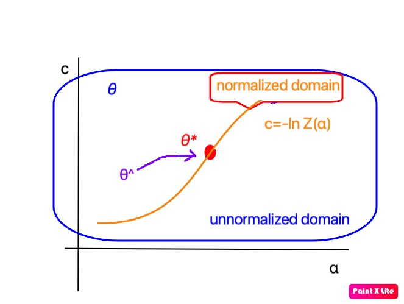

# Noise-Contrastive Estimation(NCE)

## Model

unnormlized-likelihood:
$\log p_m(x;\theta)=\log p_0(x;\alpha)+c$ where $\theta=(\alpha,c)$ without any normalization constraint for $c$, but assume $\exists \theta, p_m(x;\theta)=p_d(x)$.

after learning, $\hat{c}\approx-\ln Z(\hat\alpha)$.



### augmented distr.

data distr.: $p_d$

$D:=1$​​​ if x in data $p_d$, else =0 x generated by contrasive noise $p_n$

<center>Tab. Augmented data for NCE</center>

| X     | D    |
| ----- | ---- |
| $x\sim p_d$ (data)  | 1    |
| $x_n\sim p_n$ (noise) | 0    |

augmented distr: $p(x,d)$, with marginal distr.: $p(x)=p(1)p_d+p(0)p_n$, mixed distr of pd and pn.

Conditional Likelihood:
$$
l(\theta)=\sum \ln h(x^{(d)}_i) +\sum \ln (1-h(x^{(n)}_i))\\
=
h(u; θ) = r_\nu  (G(u; θ)) ; G(u; θ) = \ln p_d - \ln p_n
$$
where $r_\nu(x)=\frac{1}{1-\nu e^{-x}}$.


*Remark.* The joint likelihood could not be used!

*Definition.* NCE of $p(x)$ == MCLE of $p(x,d)$

### obj. function

For true data ${x^{(d)}}$ and noise data ${x^{(n)}}$,
$$
J_T(\theta):=\frac{1}{N_d}(\sum \ln h(x^{(d)}_i) +\sum \ln (1-h(x^{(n)}_i)))\\
\overset{p}{\rightarrow}
J(\theta):=E_d \ln h(x) +\nu E_n\ln (1-h(x))
$$

*Remark.* A fundamental point in the theorem is that the maximization is performed without any normalization constraint for $f$

Gradient of $J_T$:
$$
\nabla J_T = \frac{1}{N_d}\sum (1-h(x^{(d)}_i))g(x^{(d)}_i) + \nu\frac{1}{N_n}\sum h(x^{(n)}_i) g(x^{(n)}_i)\\
g := \nabla G = \nabla \ln p_m  ~\text{(score function)}
$$

for NCE,
$g=(\nabla_\alpha G, 1)^T$ and
$$
\nabla J_T =(\frac{1}{N_d}\sum (1-h(x^{(d)}_i))\nabla_\alpha G(x^{(d)}_i) + \nu\frac{1}{N_n}\sum h(x^{(n)}_i) \nabla_\alpha G(x^{(n)}_i), \\1-\frac{1}{N_d}\sum h(x^{(d)}_i) + \nu\frac{1}{N_n}\sum h(x^{(n)}_i) )
$$

*Fact.*
min $J_T$  iff train a classifier (discrimination form, with cross entropy loss) for augmented data $(X,D)$ (may not get the est. of param.)

## Properties

*nonparametric form:*
$$
\tilde{J}(f):= E_d \ln r_\nu(f(x^{(d)}_i)-\ln p_n(x^{(d)}_i))\\+ \nu E_n \ln (1-r_\nu(f(x^{(n)}_i)-\ln p_n(x^{(n)}_i)))
$$
We have $\tilde{J}(\ln p_m(x;\theta))=J(\theta)$.

**Theorem 1**
$\tilde{J}$ attains max at $f= \ln p_d$. No other extremes, if $p_d\ll p_n$

*Theorem 2(Consistency)*
$\hat{\theta}_T\overset{P}{\rightarrow} \theta^*$, if
- $p_d\ll p_n$
- $\sup_\theta|J_T-J|\overset{P}{\rightarrow} 0$
- $I=E(gg^T P)>0$, where $P=\frac{p_n}{p_d+p_n}, g=\nabla \ln p_m$

*Theorem 3(Asymptotic normality)*
$\hat\theta_T\to N(\theta^*,T^{-1}\Sigma)$ where
$$\Sigma=I^{-1}-2I^{-1}E(gP)E(g^TP)I^{-1}
$$
esp. MSE $E(\hat\theta_T-\theta^*)^2\sim T^{-1}\Sigma$

## Applications

### word2vec---embed words to vectors
word represention/embedding $v: W\to \R^d = \R^{|W|\times d}$, where $W$ is the set of words

model:
$$
p(w,c)\sim e^{v(w)\cdot v(c)}
$$
where $v(c)=\frac{1}{|c|}\sum_{w\in c}v(w)$.

noise distr:
$$
p(w,c)\sim \hat{p}(w)\hat{p}(c)^\alpha
$$

### Negative Sampling

assume $p(0)=\nu p(1)$; 
model distr: $p_1(x)\sim e^{E(x)}$, noise distr: $p_0(x)$;
energy: $E$

NS: 
$$J = \mathbb{E}_{x\sim p}\log expit(E(x))+\nu \mathbb{E}_{x\sim p_0} \log (1-expit(E(x)))\\
\approx \sum_i(\log expit(E(x_i))+ \sum_j\log (1-expit(E(x_{ij}))))
$$

It is a logistic regression of $Y\sim B(\mathrm{expit}E(x))$ with the dataset $\{(x_i,1),(x_{ij},0)\}$ where $x_i$ is the data, $x_{ij}\sim p_0$.

Note $J$ is not a conditional likelihood of $p(x,0/1)$.

$$
h=\frac{p_1}{\nu p_0 + p_1}=\frac{e^E}{\nu Z p_0 + e^E}\\
=\mathrm{expit}(E) \text{ only if $\nu Z p_0=1$}
$$

fix $\theta$, when $\nu Z p_0=1$, i.e. $p_0\sim 1$, NCE ==> NS.

How do you justify N.S. further?

Consider nonparametric form:
$$J(E) := \mathbb{E}_{x\sim p}\log expit(E(x))+\nu \mathbb{E}_{x\sim p_0} \log (1-expit(E(x)))
$$

$D J(E)=0 \iff p=p_0 \nu e^{E}$

## Conditional NCE

0/1-classifier:
$$
p(x,y|1)=p_d(x)p_c(y|x)\\
p(x,y|0)=p_d(y)p_c(x|y)
$$

data:
```
X, Y, 1
Y, X, 0
```

**CNCE loss**:
$$
J(\theta)=J(G(\theta))=E \log(1+e^{-G})\\
G(x,y;\theta)=\log\frac{\phi(x_1|\theta)p_c(x_2|x_1)}{\phi(x_2|\theta)p_c(x_1|x_2)}
$$

*Fact* Neg conditional log-likelihood of the 0/1-classifier is the empirical version of CNCE loss

*Fact*
$G^*=\argmin J(G) \iff G^* = \log \frac{p_d(x_1|\theta)p_c(x_2|x_1)}{p_d(x_2|\theta)p_c(x_1|x_2)}$

## Variational NCE

*Fact.*
1. $r(x)=E_{z\sim q(z|x)}t(x,z)$, $g$: concave ==>
   $$
   g(r(x))\geq E_{z\sim q(z|x)}g(t(x,z))
   $$
2. $r(x)=\int t(x,z) dz$, $g$: concave ==>
   $$
   g(r(x))\geq E_{z\sim q(z|x)}g(\frac{t(x,z)}{q(z|x)})
   $$

Let $g(r)=\log\frac{r}{r+\nu}$.
$J_{VNCE}:=E_{z\sim q(z|x)}g(\frac{\phi(x,z)}{p_n(x)q(z|x)})+\nu C(\phi,p_n)$ (contrastive ELBO)

*Fact.(contrastive var. indentity)*
$$
J_{NCE}-J_{VNCE}=D_f(p(z|x)\| q(z|x))\\
=D_{KL}(q\|p)-D_{KL}(q\|m)
$$
where $m(z|x) = v_x p(z|x) + (1 − v_x)q(z|x)$ and $D_f(p\|q)$: $f$-div with $f_x(u) = \log(v_x + (1 − v_x)u^{-1})$, $v_x=\frac{\phi(x)}{\phi(x)+\nu p_n(x)}$.

*VNCE Algo*
Input $p(x,z|\theta)$
Output $\theta$
1. init. $\theta_0$
2. - E: Let $q(z|x)=p(z|x,\theta^{(t)})$
   - M: $\theta^{(t+1)}=\arg\max_\theta J_{VNCE}(\theta,\theta^{(t)})=J_{VNCE}(p_\theta,p_{\theta^{(t)}})$

*Fact.* $J_{NCE}(\theta^{(t)})\nearrow$


---

*Exercises*
1. Justify N.S.
2. CNCE version of N.S.


*References*
1.  Yoav Goldberg and Omer Levy. word2vec Explained: Deriving Mikolov et al.’s Negative-Sampling Word-Embedding Method
2.  Tomas Mikolov. Distributed Representations of Words and Phrases and their Compositionality
3.  Yair Omer and Tomer Michaeli. CONTRASTIVE DIVERGENCE LEARNING IS A TIME REVERSAL ADVERSARIAL GAME, 2021.
